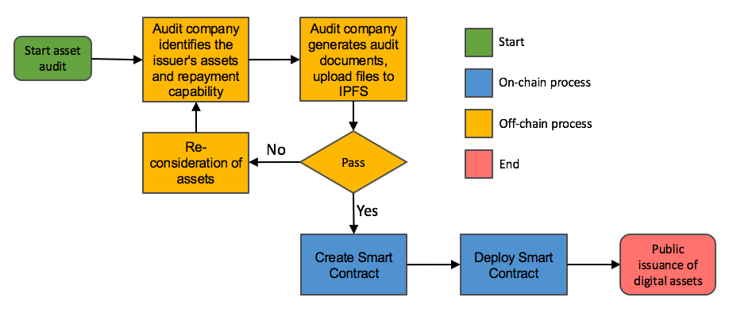
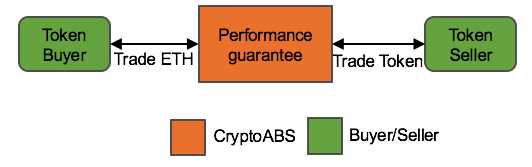
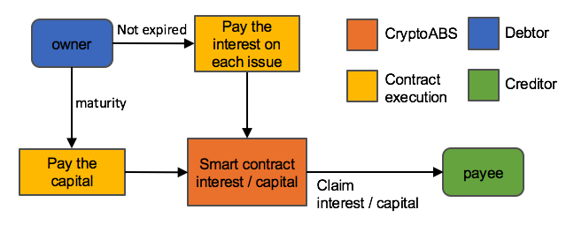

# CryptoABS White Paper

- [English White Paper](./README.md) 
- [繁體中文白皮書](./README_zh.md)
- [简体中文白皮书](./README_cn.md)

## Abstract

- Crypto-financing with physical assets.
- Using the decentralization and unaltered feature of block chain, to anchored the real assets in the block chain system.
- Issuance of Asset Certificates (Token), provides an open and transparent platform to manage and trade asset certificates (Token).
- Improved Ethereum through Asset-Backed Security

## Crowdsale Project

| Token | Crowdsale time |
|:------|:--------------:|
<<<<<<< HEAD
| [CABS #1](./tokens/CABS/CABS_TOKEN_en.md) | 2017-07-14 to 2017-08-04 |
| [CABS #2](./tokens/CABS_ZZ/CABS_TOKEN_ZZ_en.md) | 2017-09-30 至 2017-10-30 |
=======
| [ABS #1](./tokens/ABS/ABS_TOKEN_en.md) | 2017-07-14 to 2017-08-04 |
>>>>>>> d9e43d675004d2d1d731bbaf0784a53f6ed084cc

----

## Road Map

See [Road Map](./ROAD_MAP.md) for more details.

## Key Products

- CryptoABS platform
    - Financial Statement.
    - Certificate of debt-paying ability.
    - Provide secondary market transactions platform.
    - Assist in creating Smart contracts with different types of asset.
    - Proof of Assets.
    - Auditing documents.
    - Signature of regulatory unit (issuer, auditor).
- Crypto Asset-Backed Security
- Every Token has a real asset unit as a collateral.
- Open Source project
    - Cryptographic Assets Smart Contract Library

## Key Processes

- Build the CryptoABS platform.
- Build a "Proof of Asset" service that produces credit ratings system for individual Assets.
- Construct the bridge between real assets and Ethereum, with the asset certificate (Token) to replace the physical assets, to trade assets through the Smart Contract.
- Smart Contract Library with various types of asset, including Stock, Bonds.
- Construct the Trust Model of Multi-party participant supervision & control.

### Product Life Cycle

### Proof of Assets / Proof of Solvency Process

The asset verification process includes asset verification and debt-paying ability review.

### Deploy Smart Contract Process

Our platform help creating Smart Contracts, identify the subject with asset authentication, and select the template for the different Smart Contract to generate the corresponding Token.

### Transfer Token Process

Token trading process, second market

### Interest / Dividend Process

## Proof of Asset / Proof of Solvency / Cryptographic Assets Audit

Asset certification process will verify the assets through multi-party units, and only way to released Smart Contract to Ethereum block chain is through the asset certification process .
Asset certification information will be put on IPFS, and establishment a link of the smart contract to check up at any time.
Debt-paying ability certification will determine the size of the interest rate and the size of issuance by examining the solvency of the issuer.

### Proof of Asset Participants

Participants are actual companies or units outside the block chain.

#### Asset issuer

The CryptoABS platform allows any asset-certified asset issuer to issue assets through the platform, in order to anchor the asset and implement the transaction model through Smart Contract.

#### Independent auditors

The CryptoABS platform has a credit assessment company that can assist asset publishers to verify the value and quantity of assets and assist asset issuers to issue exact quantities of Token.

#### Multi-party trust mechanism

The CryptoABS platform will have a number of independent participants to provide a transparent platform for Cryptographic Assets.

## Smart Contract

Smart contract will provide three templates:
- Bonds
    - Bond-type smart contract, support periodic interest paying, payment due date.
- Stocks
    - Stock-type smart contract, equity certificate, support dividend payout, allow trading and cash.
- Assets
    - Asset-type smart contract, Token is the asset carrier, allowing trading and cash.

Smart contract will provide de-centralized trading function:
- Order book

## Oracle Entities

Communicate with external resources through Oracle concepts to get the corresponding information

## Key Benefits

### Do not need to log in via browser

All asset certification contracts are transparent and 100% through Ethereum for management and verification, can transferred Token by using ERC20 interface wallet, and the average transaction time is 15 seconds only.

### Transparent asset trading process

The accounting books of Ethereum block chain will automatically save the transaction records.

### Asset vouchers will exist on the chain forever

All the assets will be recorded in Ethereum, permanent.
Even if the CryptoABS platform shut down, each contract that has been generated can be recognized and admitted by the courts in every national jurisdictions.

## Conclusion

The CryptoABS platform will provide a transparent, easy-to-audit, secure smart contract platform for all intelligent contracts, using Ethereum to decentralize the consensus system with IPFS in the block chain implementation of Cryptographic Assets.

## Further Reading
Ethereum White Paper: https://github.com/ethereum/wiki/wiki/White-Paper
