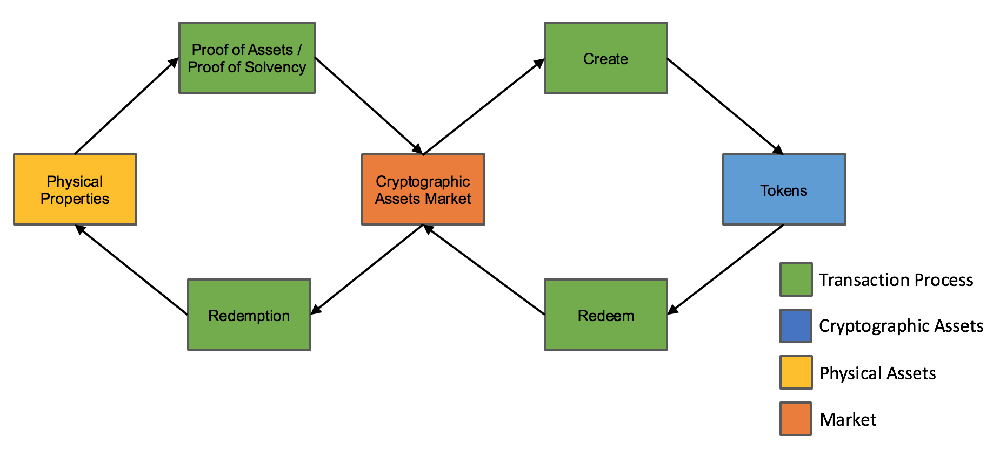
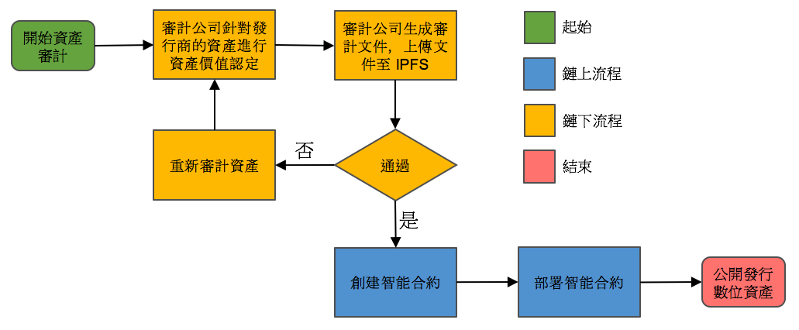
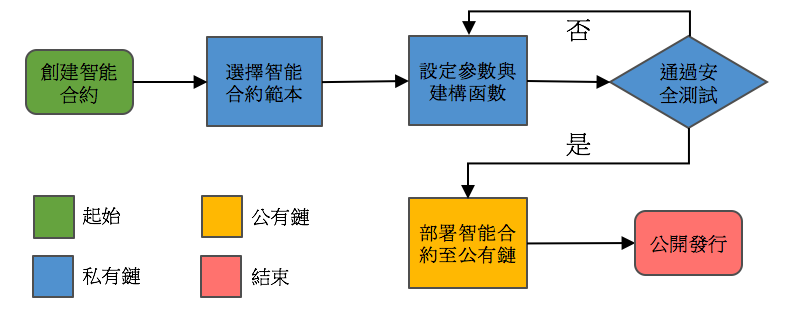
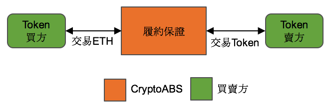

# CryptoABS White Paper

- [English White Paper](./README.md) 
- [繁體中文白皮書](./README_zh.md)
- [简体中文白皮书](./README_cn.md)

## 摘要

- 有形资产数位融资。
- 运用区块链去中心化与不可窜改的特性，将现实资产锚定于区块链上。
- 发行资产凭证(令牌)，提供一个公开透明的平台来管理与交易资产凭证(令牌)。
- 透过资产担保债券改善以太坊生态系。

## 众筹项目

[CABS](./tokens/CABS_TOKEN.md): 2017-07-14 至 2017-08-04

----

## 发展蓝图

[发展蓝图](./ROAD_MAP_cn.md)

## 主要产品

- CryptoABS 平台
    - 资产证明文件。
    - 偿还能力证明文件。
    - 提供次级市场交易。
    - 协助创建不同资产类型的智能合约。
    - 资产证明服务。
    - 审计文件。
    - 监管单位数位签章(发行商、审计商)。
- Crypto Asset-Backed Security
- 每个令牌背后都有真实资产单位做担保。
- Open Source 项目
    - Cryptographic Assets 智能合同。

## 关键过程

- 建构 CryptoABS 平台。
- 建构资产认证服务，产生各别资产的信用评等。
- 架构实质资产与以太坊的桥梁，用资产凭证(令牌)来取代实体资产，让资产透过智能合同的辅助来交易资产。
- 提供各种资产类型的智能合同。
- 建构多方参与者监管的信任模型。

### 产品生命周期

### 资产证明 / 偿付能力证明

资产验证流程包含资产验证与偿还能力审查。

### 部署智能合同流程

本平台将辅助创建智能合同，透过资产认证确认标的，选择不同智能合同的范本产生对应的令牌。

### 转让令牌流程

令牌交易流程，次级市场交易模式

### 利息/股利流程

## 资产证明/偿付能力/加密资产审计证明

资产认证将验证透过多方公正单位提出的资产证明来认证，只有透过资产证明流程才可以发布智能合同至以太坊区块链上。
资产认证资讯将会放到 IPFS 上，建立与智能合约的连结方便随时查验。
偿还能力认证将透过检验发债方的偿债能力来决定利率与发债的规模。

### 资产证明参与者

参与者均为区块链外的实际公司或者单位。

#### 资产发行商

CryptoABS 平台允许任何通过资产认证的资产发行商，透过平台发行属于自己的令牌，来锚定资产，并透过智能合同实现交易模式。

#### 独立审计商

CryptoABS 平台有配合的信用评估公司，可以协助资产发行商验证资产的价值与数量，协助资产发行商发行确切数量的令牌。

#### 多方信任机制

CryptoABS 平台会有多方独立的参与者为 Cryptographic Assets 提供一个透明的平台。

## 智能合同

智能合约将提供三种范本：
- 债券
    - 债券型智能合约，支援周期性配发利息，到期后还款。
- 股票
    - 股票型智能合约，股权凭证，支援股利股息配发，允许交易与兑现。
- 资产
- 资产型智能合约，令牌是资产的资产凭证载体，允许交易与兑现。

智能合约将提供去中心化交易功能：
- 订单簿

## Oracle 实体

透过 Oracle 概念与外部资源沟通来取得相对应的资讯

## 主要优点

### 不需透过浏览器登入

所有的资产认证合约都是公开透明完全透过 Ethereum 进行管理与验证，使用支援 ERC20 的钱包即可转移令牌，并且交易花费的时间也非常的短，平均为 15 秒。

### 透明的资产交易历程

以太坊区块链帐本上将永久保存交易纪录。

### 资产凭证将永远存在区块链上

所有的资产都被纪录在以太坊，永久存在。
即使 CryptoABS 平台关闭，已经生成的每个合约都可以在各国司法辖区被法庭承认与采纳。

## 结论

CryptoABS 平台将提供一个透明、容易审计、安全的智能合约平台，所有智能合约利用以太坊去中心化的共识系统与 IPFS 在区块链实现 Cryptographic Assets。

## 进一步阅读
以太坊白皮书: https://github.com/ethereum/wiki/wiki/White-Paper
