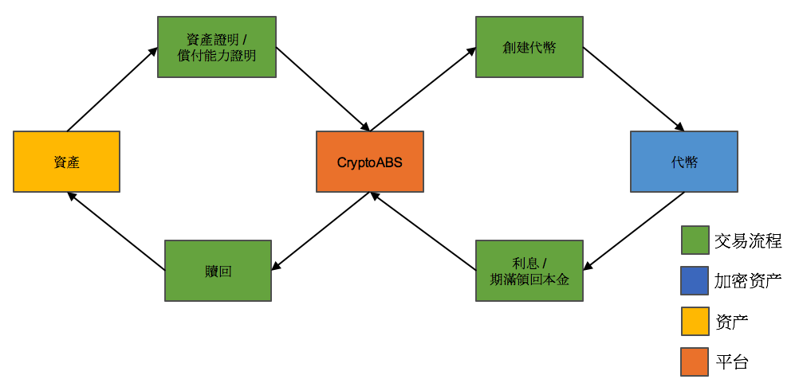
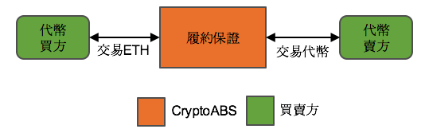
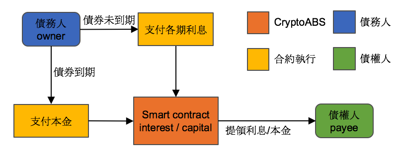

# CryptoABS White Paper

- [English White Paper](./README.md) 
- [繁體中文白皮書](./README_zh.md)
- [简体中文白皮书](./README_cn.md)

## 摘要

- 有形資產數位融資。
- 運用區塊鏈去中心化與不可竄改的特性，將現實資產錨定於區塊鏈上。
- 發行資產憑證(Token)，提供一個公開透明的平台來管理與交易資產憑證(Token)。  
- 透過資產擔保債券改善Ethereum生態系。

## 眾籌項目

[CABS](./tokens/CABS/CABS_TOKEN_zh.md): 2017-07-14 至 2017-08-04

----

## Road Map

[Road Map](./ROAD_MAP_zh.md)

## Key Products

- CryptoABS 平台
    - 資產證明文件。
    - 償還能力證明文件。
    - 提供次級市場交易。
    - 協助創建不同資產類型的智能合約。
    - 資產證明服務。
    - 審計文件。
    - 監管單位數位簽章(發行商、審計商)。
- Crypto Asset-Backed Security
	- 每個 Token 背後都有真實資產單位做擔保。
- Open Source 項目
    - Cryptographic Assets Smart Contract Library

## Key Processes

- 建構 CryptoABS 平台。
- 建構資產認證(Proof of Asset)服務，產生各別 Assets 的信用評等。
- 架構實質資產與 Ethereum 的橋樑，用資產憑證(Token)來取代實體資產，讓資產透過 Smart Contract 的輔助來交易資產。
- 提供各種資產類型的 Smart Contract Library，包含 Stock、Bonds。
- 建構多方參與者監管的信任模型。

### Product Life Cycle

### Proof of Assets / Proof of Solvency Process

資產驗證流程包含資產驗證與償還能力審查。

### Deploy Smart Contract Process

本平台將輔助創建 Smart Contract，透過資產認證確認標的，選擇不同 Smart Contract 的範本產生對應的 Token。

### Transfer Token Process

Token 交易流程，次級市場交易模式

### Interest/Dividend Process

## Proof of Asset / Proof of Solvency / Cryptographic Assets Audit

資產認證將驗證透過多方公正單位提出的資產證明來認證，只有透過資產證明流程才可以發布 Smart Contract 至 Ethereum 區塊鏈上。
資產認證資訊將會放到 IPFS 上，建立與智能合約的連結方便隨時查驗。
償還能力認證將透過檢驗發債方的償債能力來決定利率與發債的規模。

### Proof of Asset Participants

參與者均為區塊鏈外的實際公司或者單位。

#### 資產發行商

CryptoABS 平台允許任何通過資產認證的資產發行商，透過平台發行屬於自己的 Token，來錨定資產，並透過 Smart Contract 實現交易模式。

#### 獨立審計商

CryptoABS 平台有配合的信用評估公司，可以協助資產發行商驗證資產的價值與數量，協助資產發行商發行確切數量的 Token。

#### 多方信任機制

CryptoABS 平台會有多方獨立的參與者為 Cryptographic Assets 提供一個透明的平台。

## Smart Contract

智能合約將提供三種範本：
- Bonds
    - 債券型智能合約，支援週期性配發利息，到期後還款。
- Stocks
    - 股票型智能合約，股權憑證，支援股利股息配發，允許交易與兌現。
- Assets
	- 資產型智能合約，Token 是資產的資產憑證載體，允許交易與兌現。

智能合約將提供去中心化交易功能：
- Order book

## Oracle Entities

透過 Oracle 概念與外部資源溝通來取得相對應的資訊

## Key Benefits

### 不需透過瀏覽器登入

所有的資產認證合約都是公開透明完全透過 Ethereum 進行管理與驗證，使用支援 ERC20 interface 的錢包即可轉移 Token，並且交易花費的時間也非常的短，平均為 15 秒。  

### 透明的資產交易歷程

以太坊區塊鏈帳本上將永久保存交易紀錄。  

### 資產憑證將永遠存在區塊鏈上

所有的資產都被紀錄在 Ethereum，永久存在。  
即使 CryptoABS 平台關閉，已經生成的每個合約都可以在各國司法轄區被法庭承認與採納。

## Conclusion

CryptoABS 平台將提供一個透明、容易審計、安全的智能合約平台，所有智能合約利用 Ethereum 去中心化的共識系統與 IPFS 在區塊鏈實現 Cryptographic Assets。

## Further Reading
Ethereum White Paper: https://github.com/ethereum/wiki/wiki/White-Paper

